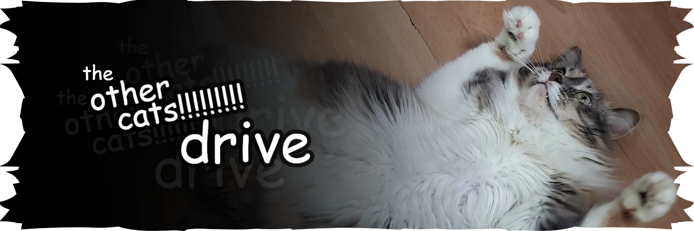

this repo powers the image host at https://misc-cdn.soggy.cat.

<table>
  <tr>
    <td><b>images</b></td>
    <td><b>videos</b></td>
    <td><b>thumbnails</b></td>
  </tr>
  <tr>
    <td>images.json 
        misc-cdn.soggy.cat/<code>(cat)</code>/*</td>
    <td>videos.json 
        misc-cdn.soggy.cat/<code>(cat)</code>/vids/*</td>
    <td>misc-cdn.soggy.cat/webp/<code>(cat)</code>/* 
        misc-cdn.soggy.cat/webp/<code>(cat)</code>/vids/*</td>
  </tr>
</table>

for the drive interface see <a href="https://github.com/ssoggycat/miscdrive-site">ssoggycat/miscdrive-site</a>.

